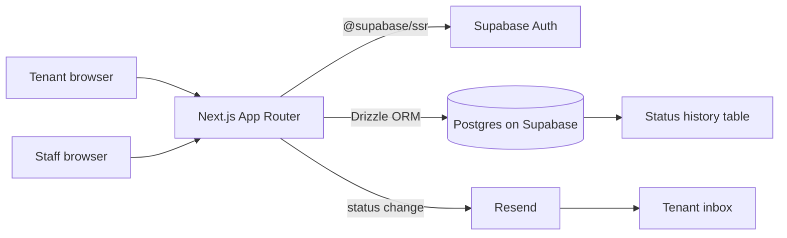

# CS Ticket System

> Internal support ticketing for property management. Tenants submit a request, support staff drag it across an Open / In Progress / Resolved / Closed board, and Resend mails the tenant on every status change.

*Built as the capstone of my software engineering internship at [Aspire Software](https://www.aspiresoftware.com/).*

[](https://nextjs.org)
[](https://www.typescriptlang.org)
[](https://supabase.com)
[](https://orm.drizzle.team)
[](https://tailwindcss.com)
[](https://resend.com)


## ✨ Features
- **Tenant submission flow.** Public form at `/` with title, description, contact info, and optional image attachments. Validated client-side with React Hook Form + Zod, mobile-first.
- **Support dashboard with drag-and-drop.** Login-only `/support` page. Staff drag tickets across Open / In Progress / Resolved / Closed columns to update status.
- **Audit trail per ticket.** Every status change is captured (who, when, from, to) and surfaced as a Popover history on the ticket card.
- **Resend email notifications.** Tenants get a styled React Email when their ticket changes status. Templates live next to the routes that fire them.
- **Auth-gated API.** Every mutation runs through Supabase SSR auth. Staff are whitelisted at the database layer, not just the UI.

## 🏗 Architecture



The status history table is append-only. Every drag-and-drop update writes a new row before the ticket's `status` column flips, so the Popover history never loses prior states.

## 🛠 Stack
- Next.js 15 (App Router, Turbopack), React 19, TypeScript strict
- Supabase Auth via `@supabase/ssr`, Supabase Postgres as the database
- Drizzle ORM (`drizzle.config.ts`) + `postgres` driver
- Tailwind v4, Radix primitives (Dropdown, Popover, Select, Navigation), Remix Icons
- React Hook Form + Zod for validation
- React Draggable for the kanban board
- Resend + React Email for tenant notifications

## 🚀 Getting started

```bash
git clone https://github.com/tabetant/cs-ticket-system.git
cd cs-ticket-system
npm install

# Set up environment variables
cat > .env.local <<EOF
NEXT_PUBLIC_SUPABASE_URL=...
NEXT_PUBLIC_SUPABASE_ANON_KEY=...
SUPABASE_SERVICE_ROLE_KEY=...
DATABASE_URL=postgres://...
RESEND_API_KEY=...
EOF

# Push the Drizzle schema to your Supabase Postgres
npx drizzle-kit push

npm run dev
```

Then open `http://localhost:3000` for the tenant view, or `/support` to log into the staff dashboard.

## 📁 Key files

```
src/app/             # App Router routes (tenant form, support dashboard, API)
src/db/              # Drizzle schema, query helpers
drizzle/             # Generated migrations
drizzle.config.ts    # Drizzle Kit config
```

## 📸 Demo

Live deployment: TBD. Screenshots: TBD.

## 👤 Author

**Antoine Tabet**, UofT Computer Engineering
[LinkedIn](https://linkedin.com/in/antoinetabetuoft) · [antoine.tabet@mail.utoronto.ca](mailto:antoine.tabet@mail.utoronto.ca) · [GitHub](https://github.com/tabetant)
